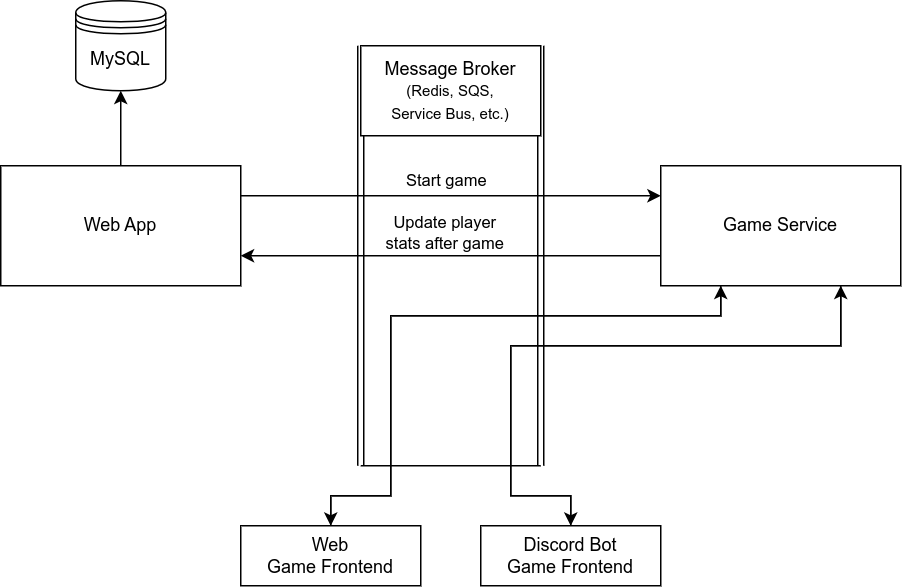

# MDP Project - WWTBAM

The project is a work-in-progress game inspired by Kahoot and "Who Wants to be a Millionaire".

## Structure

The code is organized as a monorepo. The separate components are stored in [`repos`](./repos):

- `web` - A web-based app that authenticates users and manages games, using a database to store information.
- `game` - A backend service which tracks the state of all games. May be replicated if required.
- `game-web` - A web-based frontend to a running game.
- `game-discord` - A Discord bot frontend to a running game.

Flyway is used to manage migrations for the database.

## Architecture

The two main components are the web app and the game service.
Communication between them goes through a message broker,
and is illustrated with arrows going through the message broker.

The web app uses a MySQL database to store user information and quizzes.

The game service controls real-time games that are in progress.
A game's state is rendered by the game frontends. The game service only interacts through the message broker,
allowing it to be replicated if the app is under heavy load.

### Deployment

The project runs on Kubernetes, which handles all of the deployments, services and the ingress.
Each component is containerized individually and runs in a separate pod.

Kubernetes configs are in the [`kubernetes`](./kubernetes) directory.

### Infrastructure

The project is deployed on AWS using:

- All resources live in a VPC
- EKS as a Kubernetes cluster
- ECR as a private Docker repository
- RDS as a database

The intent is to use SQS or MQ as a message broker. However, the code is incomplete and cannot handle this.
Therefore, a Redis instance is temporarily being used instead.
As this Redis instance is not intended to be part of the infrastructure, it is run in a Kubernetes pod.

All infrastructure is managed by Terraform, split into three parts:

- [`terraform-aws`](./terraform-aws) contains most definitions
- [`terraform-eks-config`](./terraform-eks-config) manages additional configuration
  which requires the infrastructure to already be available
- [`terraform-ecr`](./terraform-ecr) contains the ECR Docker repository,
  which is done to simplify development;
  in a real project, this would be part of the main Terraform script
